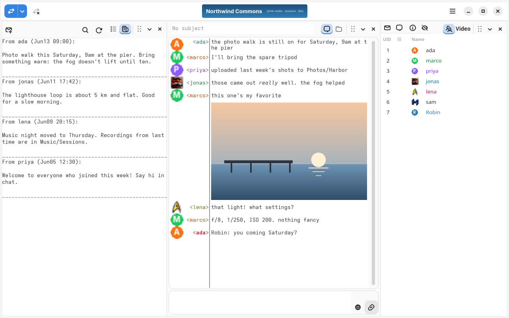
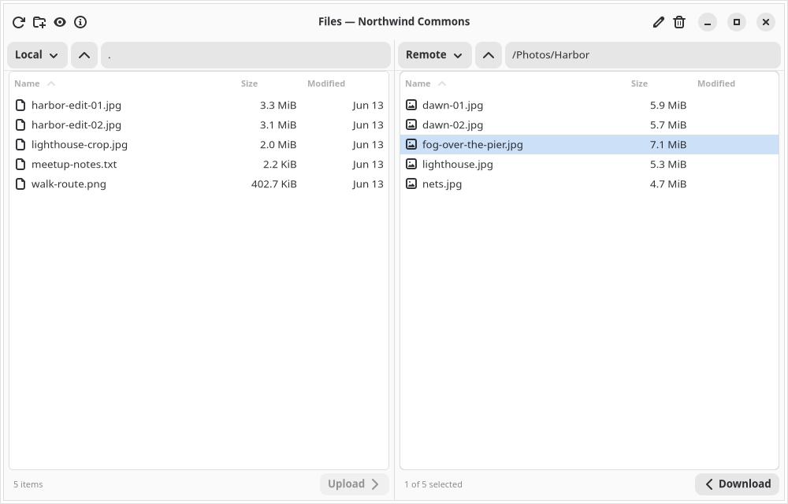
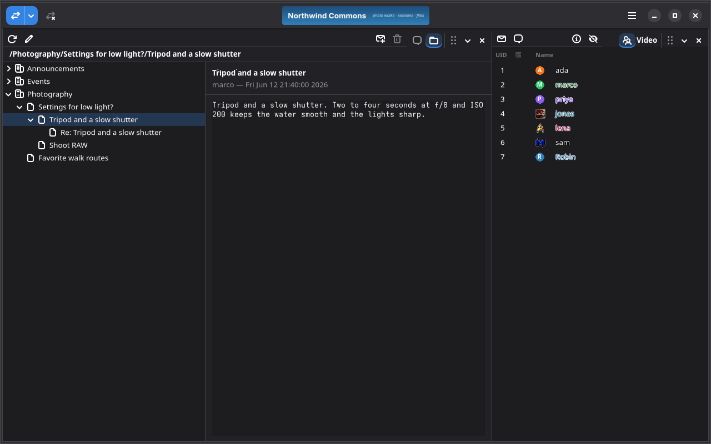
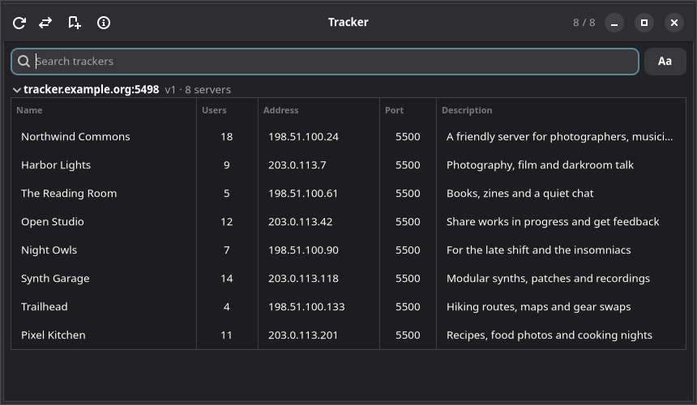
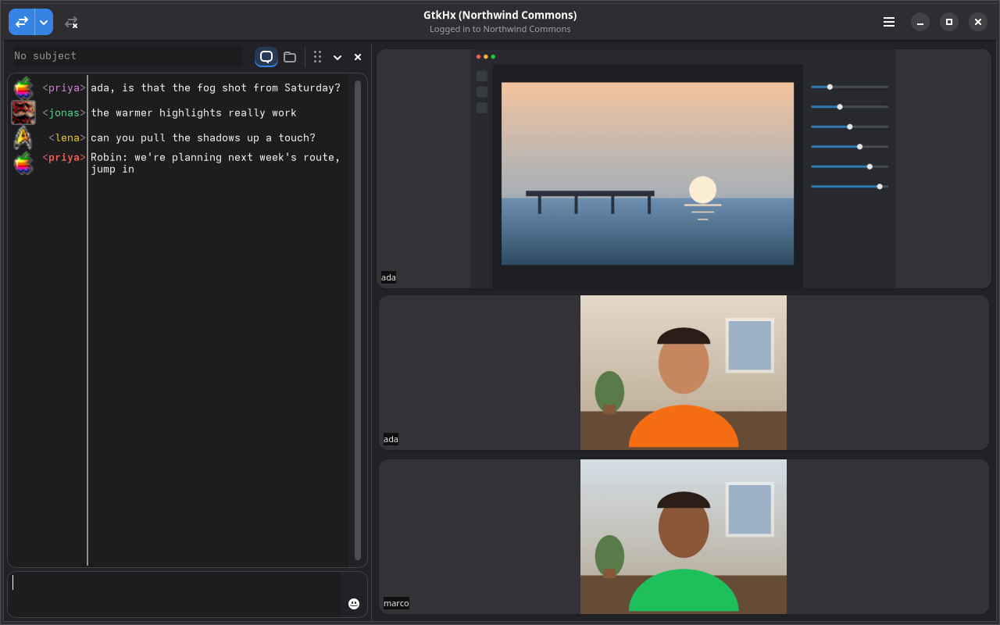
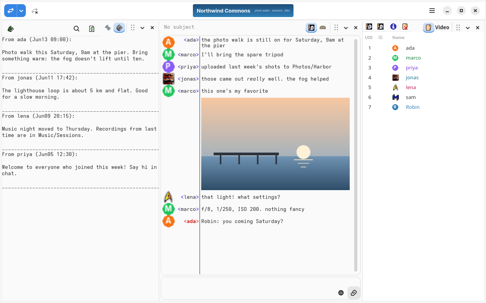

# GtkHx

GtkHx is a client for Hotline, the chat and file-sharing system from 1996.
A Hotline server is a small community of its own: a public chat room,
private messages, a shared file library, and a news board, all run by
whoever hosts it. Trackers list the servers that are up, so you can go
looking for one.

GtkHx was first written in 2000 for GTK+ 1.2. It has since been rebuilt
for GTK 4 and libadwaita, and much of it rewritten in Rust, while staying
fully compatible with the Hotline 1.2, 1.5 and 1.9 servers still running
today.



## Screenshots

| | |
|---|---|
|  |  |
| Browsing a server's files | Threaded news |
|  |  |
| Finding servers on a tracker | Video chat and screen sharing |
|  | |
| The Classic theme, with the original pixel-art icons | |

## Get GtkHx

Download the latest build for your platform from the
[releases page](https://github.com/mishan/gtkhx/releases):

- **Linux:** the `.flatpak` bundle. Install it with
  `flatpak install --user GtkHx-*.flatpak`.
- **macOS:** the `.zip` for Apple silicon (`arm64`) or Intel (`x86_64`).
- **Windows:** the `win64` `.zip`.

Or build it yourself; see [Building](#building).

## Finding a server

GtkHx comes with a few servers in Settings → Connections to get you
started. For more, open the tracker (Ctrl+T): it lists the servers that
are online now, and you can search them by name.

## Features

- **Chat** with formatted text, colored names, inline images, emoji
  shortcodes, and a searchable history
- **Private messages** and private chat rooms
- **Files:** a two-panel browser for downloading and uploading, with
  previews of images, PDFs, source code and classic Mac PICT files
- **News:** both the original flat news and threaded news with
  categories and replies
- **Voice chat, video chat and screen sharing**, on servers that support
  them
- **Several servers at once**, each in its own tab
- **Secure connections** over TLS, with fingerprint pinning, and
  encrypted logins with Blowfish or ChaCha20-Poly1305
- **Your layout:** dock panels side by side or pull them out into
  windows of their own, the way the original Hotline client worked
- **Themes**, light and dark, including a Classic theme with the
  original pixel-art icons
- **Notifications** and a tray icon
- Runs on **Linux, macOS and Windows**

GtkHx also speaks the modern extensions some servers offer: native
UTF-8, large file transfers, chat history, GIF icons, and tracker v3
with search.

### Servers

GtkHx works with any Hotline 1.2, 1.5 or 1.9 server. It is tested
against [mhxd](https://github.com/kangsterizer/mhxd), Janus,
[hxd-ng](https://github.com/mishan/hxd-ng) and the Argus tracker.

## Building

You need Meson, a C compiler, Rust (see `rust-version` in
`rust/Cargo.toml`), and:

- GTK 4.10 or newer, libadwaita 1.6 or newer, libpanel 1.4 or newer,
  GLib 2.56 or newer
- For voice and video: GStreamer 1.20 or newer, with its WebRTC plugin
  and libnice

Optional, each adding a kind of file preview: poppler (PDF),
gtksourceview 5 (source code and markdown), ImageMagick (complex PICT
images).

```sh
meson setup build
meson compile -C build
meson install -C build
```

Voice and video are built when GStreamer is found. `-Dvoice=disabled`
leaves them out, and `-Dvoice=enabled` makes a missing GStreamer an
error.

### Flatpak

```sh
flatpak-builder --user --install --force-clean build-flatpak \
    com.nasledov.gtkhx.yml
flatpak run com.nasledov.gtkhx
```

## Contributing

Tests run against a set of Hotline servers and trackers in Docker;
`tests/run.sh` builds and starts them, and
[tests/COMPOSE.md](tests/COMPOSE.md) describes the setup. Then:

```sh
tools/isolated-run.sh meson test -C build
```

`tools/isolated-run.sh` runs the tests on a private display and audio
server, so they can't reach your desktop.

- [docs/](docs/README.md) explains how each part of GtkHx works.
- [ROADMAP.md](ROADMAP.md) is what's planned, and
  [BACKLOG.md](BACKLOG.md) the smaller known gaps.
- [CLAUDE.md](CLAUDE.md) is the orientation guide to the codebase.
- The screenshots above are generated; see
  [docs/screenshots.md](docs/screenshots.md).

## License

GtkHx is free software, under the GNU General Public License, version 2
or (at your option) any later version. See [LICENSE](LICENSE).
